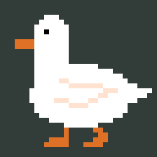

# DuckReminder

<p align="center">
  
</p>

**DuckReminder** es un pequeño desktop pet para Windows escrito en Python. Un pato pixel art aparece caminando por la pantalla con un cartel configurable para recordarte tareas, pausas o cualquier mensaje que quieras tener presente sin usar una ventana tradicional de notificaciones.

## Funciones

- Pato pixel art animado sobre el escritorio.
- Texto del cartel configurable.
- Intervalo entre apariciones ajustable.
- Vista previa inmediata desde la configuración.
- Inicio automático con Windows.
- Minimización a la bandeja del sistema.
- Interfaz en español e inglés.
- Generación de ejecutable `.exe` con PyInstaller.
- Instalador para Windows mediante Inno Setup.

## Requisitos para desarrollo

- Python 3.12
- Pillow
- pystray
- PyInstaller, si quieres compilar el ejecutable
- Inno Setup, si quieres generar el instalador

## Ejecutar desde código

Instala las dependencias del proyecto y ejecuta:

```bash
python main.py
```

## Generar el ejecutable

En Windows:

```bat
build_exe.bat
```

El script utiliza PyInstaller para generar una versión distribuible de la aplicación.

## Generar el instalador

```bat
build_installer.bat
```

Este proceso construye la aplicación y luego utiliza `installer.iss` para preparar el instalador de Windows.

## Estructura principal

```text
DuckReminder/
├── main.py                 # Aplicación principal
├── locales/                # Traducciones ES/EN
├── duck_transparent.png    # Sprite utilizado por la app
├── app_icon.png / .ico     # Iconos
├── build_exe.bat           # Build con PyInstaller
├── build_installer.bat     # Build + instalador
├── installer.iss           # Configuración Inno Setup
└── CREDITS.md              # Créditos/licencia del recurso gráfico
```

## Idea de uso

DuckReminder está pensado como una alternativa visual y liviana a los recordatorios tradicionales. Algunos ejemplos:

- recordar tomar agua;
- levantarse después de mucho tiempo frente al PC;
- mostrar una tarea pendiente;
- recordar una llamada o actividad periódica;
- usar un mensaje personalizado durante la jornada.

## Créditos y uso del sprite

El sprite del pato proviene de una publicación de la comunidad de Aseprite. **No debe asumirse como un recurso libre para uso comercial.**

Antes de redistribuir, modificar para distribución pública o monetizar una build, revisa [`CREDITS.md`](CREDITS.md) para conocer la atribución y las notas disponibles sobre el recurso original.

## Estado del proyecto

Proyecto pequeño y funcional orientado a Windows. La aplicación principal, bandeja del sistema, configuración, inicio automático y flujo de empaquetado están implementados.
